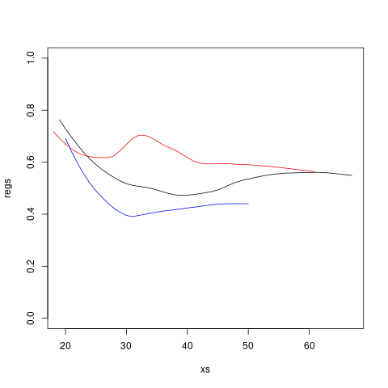

# Homework 3

# Due Tuesday, May 23, 11:59 pm

# Problem 1 (of 1)

## Motivation

This problem is motivated by our class discussion of the "2.5X" factor
in the *Pro Publica* analysis:

> Defendants younger than 25 years old were 2.5 times as likely to get a
> higher score than middle aged offenders, even when controlling for prior
> crimes, future criminality, race and gender.

Recall that this seemed odd to me, because the logistic model is
nonlinear.  Marginal effects like this depend on the values of the other
features.  The degree of impact of age, for instance, is different for
different races, genders, and so on.

After looking at the authors' code, I found that their 2.5X factor came
from defining a base case consisting of 0s for all variables, including
0s for the dummy variables.  This is fine, but here you will develop
something better.

## Details

Write a function with call form

``` r
conditDisparity(data,yName,sName,xName,condits,qeFtn,
   minS=50,yLim=NULL,useLoess=TRUE) 
```

where the arguments are as follows:

*   data, yName: as in qeML functions; Y must be numeric
*   xName: name of a numeric column
*   sName: name of the sensitive variable, an R factor
*   condits: an R vector; each component is a character string for an R logical     expression, representing a desired condition; these must NOT involve sName
*   qeFtn: qeML function (will use default arguments only)
*   minS: minimum S group size; if the number of data points for a
    certain level of S is below this, that level will not be included
*   yLim: a 2-element vector specifying the lower and upper vertical
    bounds for the plot
*   useLoess: see below

For instance, for the *Pro Publica* analysis, a possible call could be
(using the dataset **compas.rda** in our course data collection)

```,r
compas$two_year_recid <- as.numeric(compas$two_year_recid == 'Yes')
conditDisparity(compas,'two_year_recid','race','age',
   c('priors_count <= 4','decile_score>=6'),qeKNN)
```

This would produce a plot in which there is one curve of recidivism
probability against age for each race, among defendants with at most 4
priors and a decile score of at least 6.  Here the regression function
used for P(recidivism | ...) is **qeKNN**.

The role of the **yLim** argument is to set the vertical range of the
plot.  One must take care to avoid having a plot that cuts off the upper
portion of some curves, or squashes all the curves together.  One way,
though not the only way, is to leave it in the user's hands, via this
argument.

*Loess* is a smoothing method.  Curves like this will often be "bumpy,"
due to sampling variation; the smaller the dataset, the bumpier. Loess
smooths this out, essentially having each data point "borrow
information" from the others.

Running the above example produces



Of course, your code will also produce a legend, showing which color
represents which level of S, and title/labels.  

The black (African-American) and blue (Hispanic) curves exhibit the
behavior found by *Pro Publica*:  During "middle age," the probability
of recidivism declines.  But the red curve (Caucasian) shows the
opposite.  This shows the importance of exploring interactions between
variables.

## Tips

* There are many "little details" to deal with here.

* It is imperative that you use a debugging tool to track down bugs.

* You may find the **subset()**, **evalr()** and **sprintf()**functions 
    useful.  

* Be careful with data types.  If you subset an R factor (whether or not you use 
    **subset()** to do so) to remove certain levels, the latter will still 
    appear in the output of **levels()**.  Consider using **regtools::toSubFactor()**.
